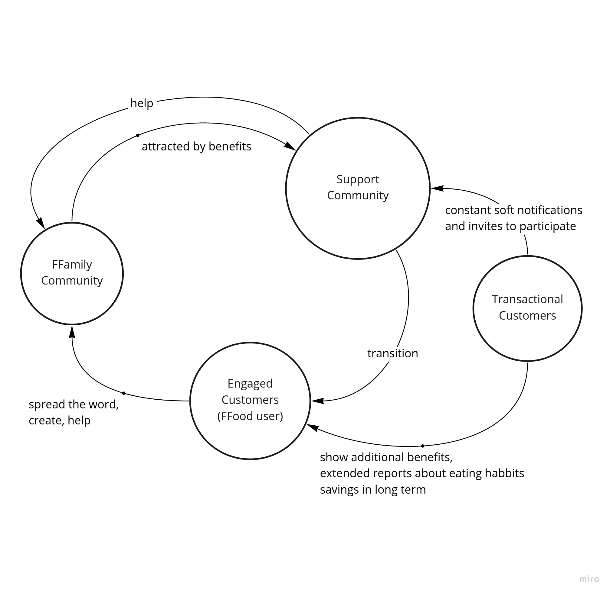

< [Back to Home](../README.md#solution-structure)

# Glossary

Most of the terms in the glossary have an abbreviation. Purpose of it is to create a [ubiquitous language](https://martinfowler.com/bliki/UbiquitousLanguage.html) that will be understandable by developers and other users within the domain.

## Abbreviations

| Acronym | Meaning |
| --- | --- |
| BD | Business Drivers |
| CM | Community Member |
| COTS | Commercial off-the-shelf |
| CRUD | Create, Reade, Update, Delete|
| DAP | Data Analytics Platform |
| EC | Engaged Customer |
| eD | eDietian |
| EDA | Event Driven Architecture |
| FFamily | Farmacy Family |
| FFood | Farmacy Food |
| FPot | Farmacy Pot |
| GEC | Group of Engaged Customer |
| HL7 | Health Level Seven |
| M2M | Machine to Machine |
| OCR | Optical Character Recognition |
| OSS | Open-Source Solutions |
| P2P | Peer to peer |
| PoS | Point of Sale |
| Practitioners | Doctors and Dietitians |
| SAR | Significant Architectural Requirements |
| SC | Support Community |
| SF | Smart Fridge |
| TC | Transactional Customer |

## Systems:

- **Farmacy Food** (FFood) - Original system responsible for interactions with TC.
- **Family Food** (FFamily) - Extension to FFood system. This system is responsible for developing relationships with FFood customers, converting TC to EC, handling data analytics and community management.
- **Clinic** - A medical center that has access to FFamily user's data. A clinic monitors, tests and analyzes the user's data in order to provide better advice to him/her/their.

## Users:

- **Transactional Customer** (TC) – Farmacy Foods client using Point of Sale (POS), this client has no engagement with Farmacy Food ecosystem.
- **Engaged Customer** (EC) - Farmacy Family (FFamilly) and Farmacy Food (FFood) client bind by membership.
- **eDietian** (eD)- A nutrition expert that has access to customer profiles who advise and monitor EC or GEC.
- **Clinician** - A medical doctor that interacts with FFood system.

## Groups:

- **Community** (GEC) - Group of ECs within a neighborhood.
- **Support Community** (SC) - Engaged members within a community.

  

## Terms:

- **Point of Sail** (PoS) - Physical location holding smart fridges
- **Smart Fridge** - A [fridge](https://www.farmacyfood.com/smartfridges) holding meals that allows user to interface with it by a mobile device.
- **Integration Patters** TODO

< [Back to Home](../README.md#solution-structure)
