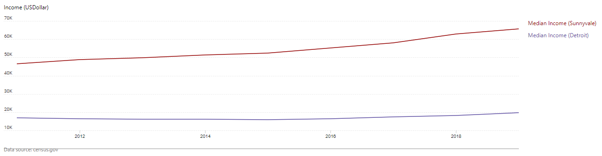
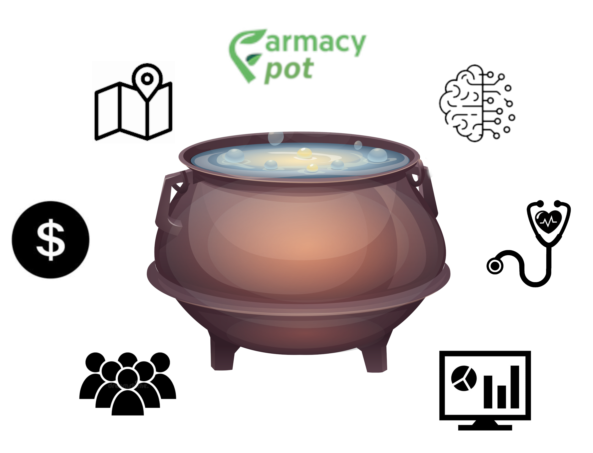

< [Back](README.md) < [Back to Home](../README.md#solution-structure)

# Strategy

This section contains a strategy that will help FFood/FFamily to achieve business goals while being integral to its mission. We decided to add this section because it will give a greater meaning to the concept around FFood/FFamily values. As well, we'd like to show that a context forms the solution!

## Context

Socio-geographical context has a huge impact on the business of FFood/FFamily. The same take on health and wellness for FFood/FFamily would look different in Sunnyvale -the richest city in the USA, and Detroit -the poorest city in the USA.

|  |
|:--:|
| [Sunnyvale vs Detroit - median income comparison](https://datacommons.org/tools/timeline#place=geoId%2F2622000%2CgeoId%2F0677000&statsVar=Median_Income_Person) |

Because of that, socio demographic groups will differ in those two cities. That's why FFood/FFamily preliminary target groups are low-income citizens naturally this would create groups of elderly people, veterans, poor families. Understanding needs of target groups will shape Software Architecture/Solution.

## Problems

Demographic groups that FFood/FFamily is targeting have completely different drivers and take on food.

1. **Price** - limited budget leans towards unhealthy food.
1. **Lack of time** - it's more profitable to work for one hour, rather than cook for two. (see p.1)
1. **Spatial** - there is a short radius in which you'll move to get access for healthy food.
1. **Health** - prioritization of work over health. (see p.2)

Additionally, the ambition of FFood/FFamily to be a data driven start-up, contributes to the problem as well. Why? To make data-driven decisions, you need to have data! However, busy or elder people might not have time or patience to enter data to the FFood/FFamily system. All this will drive UX and UI, so now software quality attributes such as: learnability, usability, and accessibility might be on top of the software quality attributes list.

Fighting with problems or following dietitian advice is much harder alone. Building a supportive community around helps achieve better results. Examples of Anonymous Alcoholics and other similar groups give participants hope.  Providing a right tool for people with targeting issues will find their way to success.

## Solution

To break barriers mentioned in problems definition and to get user data, you need to satisfy customers' needs. Hence, we came up with a concept called Farmacy Pot (FPot) illustrated in the image below.

  |  |
  | :---: |
  | **Farmacy Pot - Concept** |

Farmacy Pot (FPot), is a concept that aggregates customers around their needs and gets them a meal. A Pot is created around customer profile such:

- **Dietary** - e.g. gluten or lactose intolerance pot.
- **Health** - e.g. a pot for diabetic customers, overweight.
- **Spatial** - e.g. the closest to customer PoS or SF, community activities, community discovery.
- **Demographic** - e.g. diverse meals for the whole family.
- **Financial** - e.g. a pot can be shared among customers where a group can chip in (economy of sharing).

All those aspects should support engagement and motivate to spread a word about FFamily/FFood opportunities.

Happy FFood users with a proper direction from the Engagement Engine could help increase the brand recognition for potential users.

## Benefits

Faramcy Pot is a good excuse to create a community around it and form deep relationships with this community. Interaction with the community is the perfect moment to convert TC to EC and form groups around them, it's also a good moment to convince users to create and share their data.

Faramcy Pot is where eD interact with groups and takes care of them. It's a channel for one-to-many communication.

FFamily can convert data extracted from a FPot and present it to the EC, eD and Clinician. That will benefit all stakeholders.

Based on "collective economy" FFamily can analyze preferences and offer recipes based on product list. This is also a great source of analytics.

"Spatial" functionality can be useful for local shops to inform users about discounts and attract them to spend money in the neighborhood area.

## Risks

- Access to smartphones and data plans for FFamily target audience.
- Build trust in EC to participate in the model of "collective economy".

## Monetization

Several business models can be applied to a concept of Farmacy Pot.

### Direct:

- **Individual payment** - a customer pays for an individual meal in FFood to try out time saving and new tastes.
- **Selling analytics** - anonymized data, but habits, health condition, preferences - can be processed and sold.
- **Shared economy** - chip in, as long as numbers match and people get full stomach it's win-win for all.

### Indirect:

- **Advertisement** - local businesses (e.g. grocery stores) can use FFamily to promote their products.
- **Solicitation**  - eD can have access to EC/GEC dietary habits and provide premium advice.

< [Back](README.md) < [Back to Home](../README.md#solution-structure)
