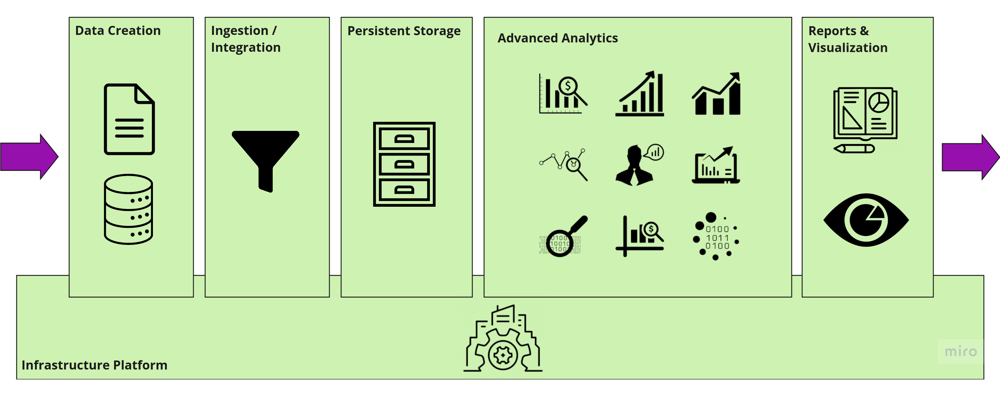
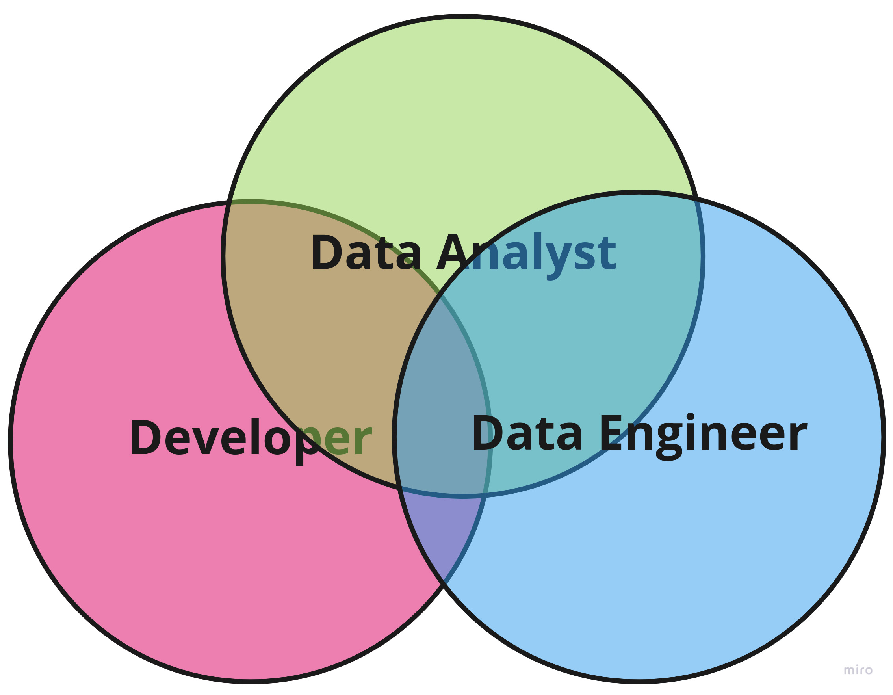
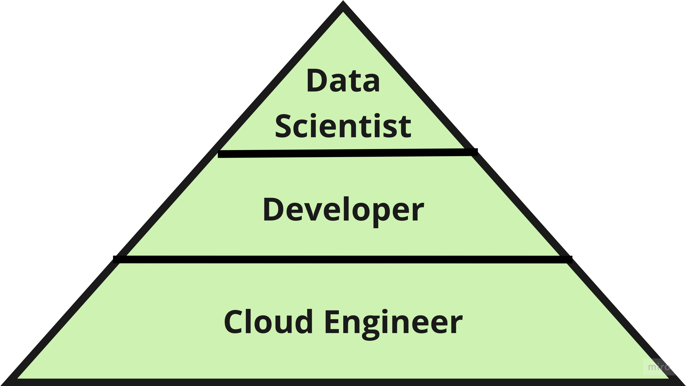
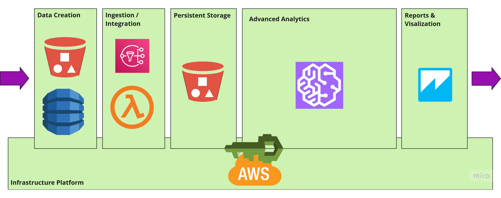
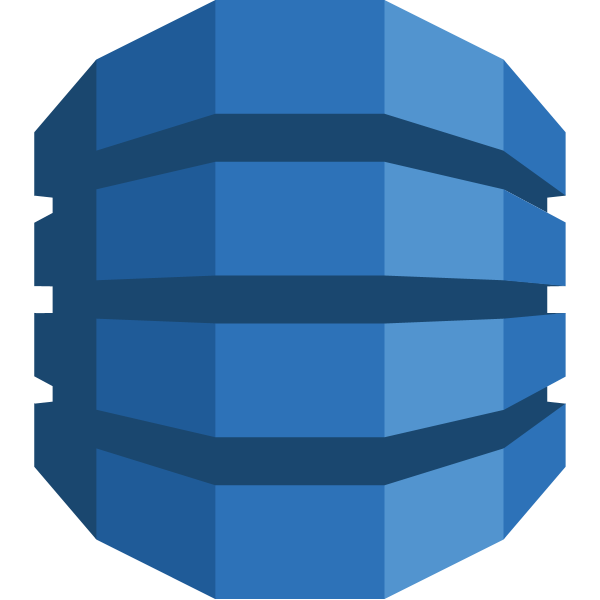
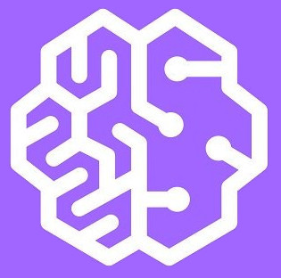

< [Back](README.md) < [Back to Home](../README.md#solution-structure)

# Data Analytics Platform

This section proposes architecture for data and analytics activities of FFamily business.

# Data Platform Architecture

The below diagram illustrates the architecture of **Data Analytics Platform**. The diagram has been designed with the ELT (Extract, Load, Transform) process in mind. The ELT process starts in the first box from the left and ends in the last box on the right.

|  |
| :---: |
| **Data Platform Architecture** |

Architecture of Data Analytics Platform shows areas of responsibilities:

- Data Creation - area where external and internal data is extracted from.
- Data Ingestion - area that fetches and transforms data.
- Persistent Storage - a data lake holding data being ready for analysis.
- Data Analytics - a data mining area, here information is inferred from data residing on persistent storage.
- Data Visualization and Reporting - area that transfers information into comprehensive and appealing form.
- Infrastructure Platform - a platform supporting all above activities.

# Data Platform Team

It's hard to talk about organizational topology when we are dealing with a small startup. Yet, Conway's law applies to every organization independently of its size. The Conway's law states that:

> Any organization that designs a system will produce a design whose structure is a copy of the organization's communication structure. - Malvin E. Conaway

FFamily solution is an extension to FFood system - which is implemented as a modularized monolith. FFamily solution will naturally lean towards it.

It's important to mention areas of responsibilities within the Data Analytics Platform. We can distinguish several roles that are needed to sustain FFamily data platform: Developer, Cloud Engineer,  Data Engineer and Data Analyst. Because there is an overlap between skills of Developer, Data Engineer and Data Analyst, we are proposing to unify these three jobs into a role of Data Scientist.

|  |
| :---: |
| Data Scientist |

Data Analytics Platform **Core Team** is illustrated in the image below.

|  |
| :---: |
| **Core Team** |

# Data Platform Services

Because Amazon is the default cloud provider for FFamily, we'll utilize appropriate Amazon services applicable for every area in the Data Analytics Platform.

|  |
| :---: |
| **Data Platform Architecture** |

Every area in Data Analytics Platform has a role that is specialized in that area. The reality is that responsibilities in a role can be shared between different members of a core team.

| | Area | Role |
| -- | --- | --- |
|  | Data Creation | Developer |
|  | Data Ingestion | Data Scientist / Developer |
|  | Data Analytics | Data Scientist / Developer |
|  | Reporting & Visualization | Data Scientist |
|  | Infrastructure Platform | Cloud Engineer |
| | | |

# AWS Services Explained

| | Service | Purpose |
| :---: | --- | --- |
|  | DynamoDB | Managed NoSQL database  |
|  | Simple Notification | Messaging service |
|  | Lambda | Event-driven serverless computing platform |
|  | QuickSight | Tool for data visualization |
|  | SageMaker | Machine-Learning platform |
|  | IAM | User Access Management |

< [Back](README.md) < [Back to Home](../README.md#solution-structure)