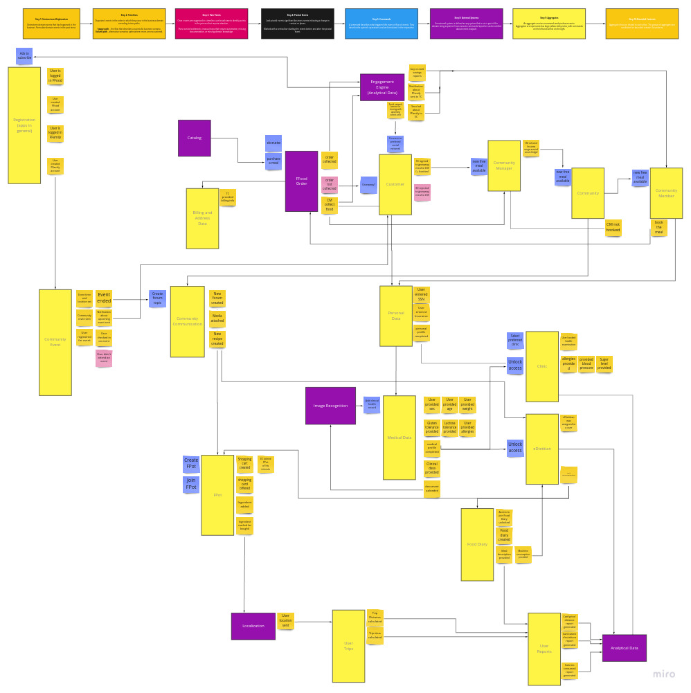

< [Back](README.md) < [Back to Home](../README.md#solution-structure)

# Event Storming

EventStorming is a tactical tool for sharing business domain knowledge. It's a low-tech activity for a group of people to brainstorm and rapidly model a business process. An EventStorming session has a scope: the business process that the group is interested in exploring.

The participants are exploring the process as a series of domain events, represented by sticky notes, over a timeline. Step by step, the model is enhanced with additional concepts—actors, commands, external systems, and others—until all of its elements tell the story of how the business process works.

# Why Event Storming?

Because we choose to implement our solution in EDA style. The event storming session was a perfect tool which allowed us to extract business events that we were interested in to build analytical and predictive models, utilized in the engagement engine.

# Outcome

An outcome of the event storming session is presented in the image below. As the user interacts with the system we are managed to locate key events, external systems and commands.

|  |
| :---: |
| **Event Storming Board** |

Without access to domain experts it's impossible to build accurate event flow, but it's the basics that allows us to show what can happen in the system and what we can track for further analysis.

Even for this session we were focused on discovering possible domain events without much attention to other parts of this workshop. Events are a key part of the data lake.

Based on event storming findings we can:
- validate general ideas
- provide points for further investigations how engagement engine should work
- understand what exactly do we need from OSS solutions, where should be points of extensibility
- give data scientist overview on domain and involve them in discovery process, adjust subdomains to provide more information

< [Back](README.md) < [Back to Home](../README.md#solution-structure)