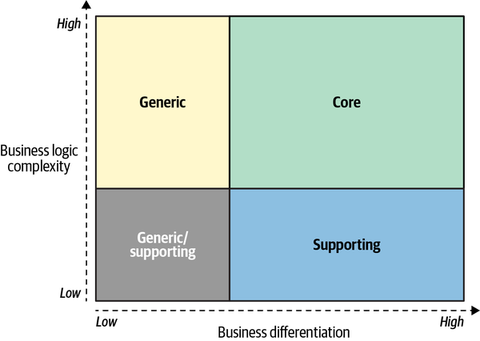
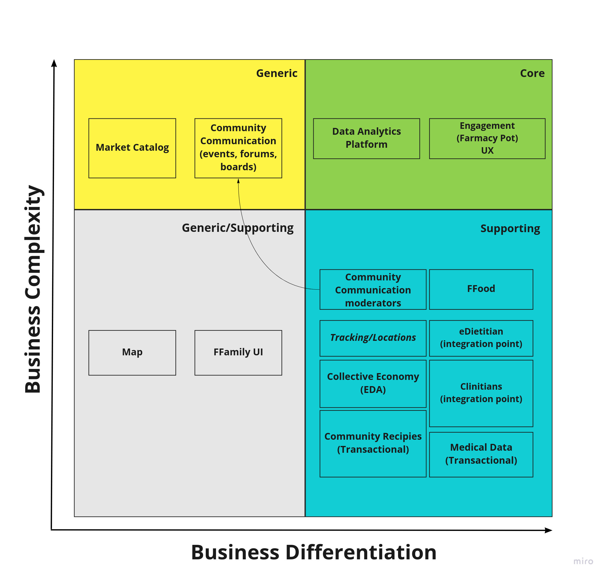

< [Back](README.md) < [Back to Home](../README.md#solution-structure)

# Solution Overview

The purpose of this document is to identify the business' main domain and subdomains that FFamily operates in. The final solution will be influenced by guiding principles.

## Principles

1. Strive for cognitive simplicity
2. Extensibility and modifiability preferred in case of trade-offs
3. Messages over direct calls
4. Use open source software (OSS) where possible and COTS first

## Style

Based on provided principles, the system should be n-tier with an event-driven architecture (EDA) style (on a very basic level) for main services - that gives us the ability to build "lake of domain events" for further analysis. Based on [business goals](../1.ProblemBackground/business_goal_and_context.md) (number of users, current and desired functionality) and [constraints](../1.ProblemBackground/constraints.md) **the primary implementation style of architecture is EDA + Event Sourcing for domain events**.

The core elements are related to data analysis and there are specific rules for building data lakes for data analytics platform.

Supporting subdomains should be capable of providing state of data (facts), and primarily events (intentions of users and their actions).

If there is no suitable OSS solution, then transactional style of logic implementation should be applied. All community support features seem to be limited to CRUD operations without complicated interaction logic. The only additional requirement is to emit an event when something changes. Justification for this is [here](#simplicity-of-supporting-subdomains).

# Main Domain

A *business domain* defines a business' main area of activity. It’s the main service the company provides to its clients.

* FFood main domain is selling healthy food.
* FFamily main domain is engagement with local community.

# Subdomain

A subdomain is a fine-grained area of business activity. All of a company’s subdomains form its business domain.

Below diagram shows relations between business differentiation and business complexity in  three types of domains: **core**, **generic** and **supporting**.

|  |
|:--:|
| [The business differentiation and business logic complexity of the three types of subdomains - LDDD book](https://learning.oreilly.com/library/view/learning-domain-driven-design/9781098100124/ch01.html#comparing_subdomains) |

The ratio of these two aspects is addressed differently among the three types of subdomains, and the below table shows trade-offs between them.

| Subdomain type | Competitive advantage | Complexity | Volatility | Implementation | Problem |
| --- | --- | --- | --- | --- | --- |
| Core | Yes | High | High | In-house | Interesting |
| Generic | No | High | Low |	Buy/adopt | Solved |
| Supporting | No |	Low |	Low |	In-house/outsource | Obvious |

## Core

A core subdomain is what a company does differently from its competitors that gives it advantage.

We arrived at the conclusion that the core domain for FFamily is  Data Analytics capabilities. This is what makes FFamily different from other social aggregators. Extraction of the information from customers data, sharing this information back to the customer and with 3rd parties to benefit customer health.

## Generic

Generic subdomains are business activities that all companies are performing in the same way.

After a brainstorming session we identified that a generic domain for FFamily is to connect, gather and communicate with a local community.

## Supporting

Supporting subdomains support the company’s business but do not provide any competitive advantage.

We concluded that supporting domain for FFamily is to create appropriate content for customers groups.

# Conclusions

|  |
|:--:|
| Subdomains |

## Core Subdomain

In core subdomain we defined two entities:
- **Data Analytics Platform** - all tasks related to better decisions for FFood/FFamily and its customers. Gather and store business events in categorized pools. This subdomain provides data for the engagement subdomain and analyzes users behavior and reactions to the Engagement actions.
- **Engagement UX** - is where a deep relationship with the community is created (FPot concept). Tasks are: gamification, informing, advertising, involvement, keep engagement - in various shapes and forms.

We believe that these two elements give competitive edge (differentiation) to the FFood/FFamily business. Our solution will be implemented in-house. Complexity in this solution might not be due to an implementation, but rather to the difficulty of combining and maintaining services that will make a Data Analytic Platform.

## Generic Subdomain

In this segment of high/middle complexity and low business differentiation, we identified two elements.

- **Community communication** - tasks involving content creation etc.
- **Market Catalog** - tasks related to supporting information about related shops discounts in the shops etc.

Because, generic subdomain is already solved and the start-up has limited budget, we will try to adopt Open-Source tools for social network management.

## Supporting Subdomains

Supporting subdomains consist of:

- **Collective Economy** - management and orchestration of tasks for customers who are participating in the collective economy.
- **Community Communication** -  moderation tasks related to community.
- **Medical Data** - tasks related to collecting and sharing customers medical data.
- **eDietitians** - 3rd party integration with dietitians.
- **Clinicians** - 3rd integration with clinicians.
- **FFood** - 3rd party integration with FFood system.
- **Tracking** - notifications based on geolocations and gathering traveling analytics

Since supporting subdomain touches upon an obvious problem and complexity of the problem is low, implementation of these components will be done in-house - this decision is amplified by the limited budget of the start-up as well.

# Simplicity of Supporting Subdomains

Here, we'd like to justify why we think that supporting subdomains will be quite simple and don't need advanced patterns for implementation.

First, if we could find a suitable OSS solution for business, then we wouldn't have any impact on implementation style. We would have to track changes to form/guess domain events to feed analytical models.

If we can't find an OSS solution, or OSS’s  solution is complicated and there is no way to gather necessary data. Then we could build our own version with basic functionality. Most of the proposed subdomains operate with simple entities that can be modified only by the owner. In this case there are no requirements for strong consistency. The top consistency level that is required is the "causal consistency" when information is consistent only for the viewer.

Think about "community recipes''. There is no collective work on a recipe that would cause simultaneous changes. There are only simple CRUD operations from the owner. Others can only read this data. It even can be treated as a regular forum post, where others can only view the original message and add comments. Moreover, order of comments follows casual consistency. It doesn't matter in which order to show replies if two persons replied to the same message. Those replies have the same root and do not intersect between each other.

Creating a shopping cart list also is not collective work -in terms of modifying simultaneously the same object, no Conflict Resolution Data Types (CRDT) is required. Components are added one by one, and it's ok to have duplicates, because one person can delete odd items when everyone agrees that the list is completed.

Medical data is fulfilled only by the user. Even if there is backward sync from a clinic, the user should review data and accept it - or just add it as another document.

All that means that FFamily community support features are extremely simple and do not require complex solutions.

< [Back](README.md) < [Back to Home](../README.md#solution-structure)