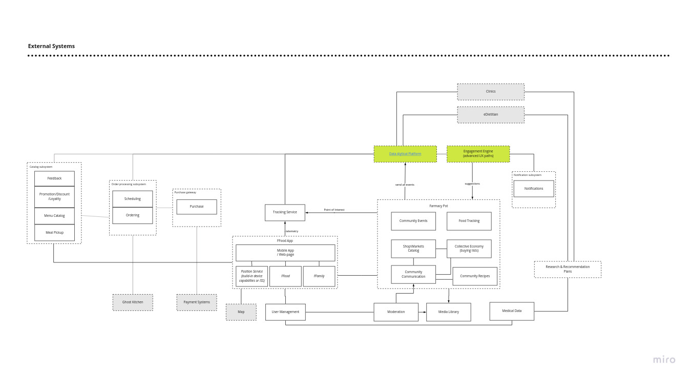
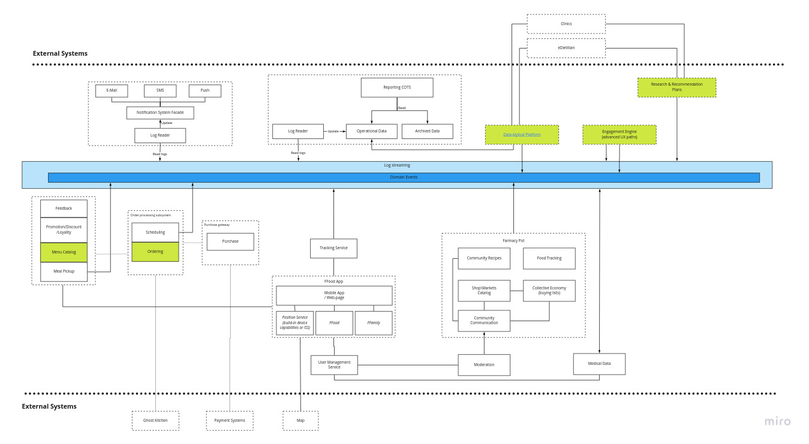
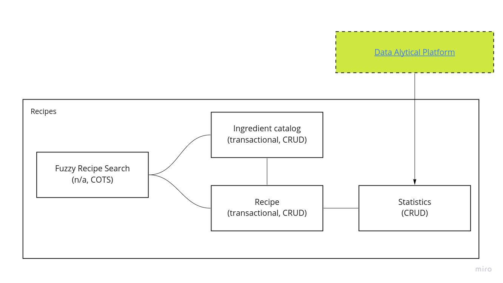
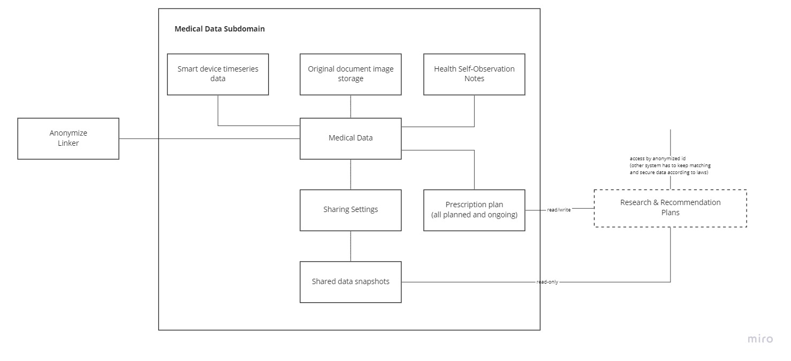

< [Back](README.md) < [Back to Home](../README.md#solution-structure)

# System Approach

In this document we will examine the whole system. It will help us to have a unified vision for its development.

# Quality Attributes

[Quality Attributes](https://en.wikipedia.org/wiki/List_of_system_quality_attributes) in this section has been divided into two groups, **system** quality attributes and **user experience (UX)** quality attributes.

## System Quality Attributes

Quality attributes applicable to the system as the whole. We identified them based on requirement analysis and user journeys.

1. **Extensibility** - is a measure of the ability to extend a system and the level of effort required to implement the extension. Extensions can be through the addition of new functionality or through modification of existing functionality. The principle provides for enhancements without impairing existing system functions.

    - Currently there are only basic ideas about features that will exist in FFamily, but we expect further development and appearance of new engagement and\or functional modules. So extensibility is essential for us. Also, currently identified modules should provide rich information about users behaviour and the system should be ready to provide new events if it would be necessary for an analytical and engagement engine.

1. **Interoperability** - ability to integrate with other systems easily.

   - Our solution must integrate with 3rd party systems that we can't modify or impact. So the solution should be ready to operate and gather information in a highly heterogeneous environment.

## User Experience Quality Attributes

Quality attributes applicable to UX and UI aspects of the solution.

1. **Usability** - is the degree to which a software can be used by specified consumers to achieve quantified objectives with effectiveness, efficiency, and satisfaction in a quantified context of use

   - The target audience is not highly skilled computer/IT-tech users, so the usability is one of the concerns. Especially thinking about other platforms that allow users to create groups and chats.

1. **Learnability** - is a quality of products and interfaces that allows users to quickly become familiar with them and able to make good use of all their features and capabilities

   - Ease of discovering and using features that applications provide. Understanding what can be accomplished with the app increases engagement of users.

1. **Accessibility** - is the ability to access and benefit from some system or entity, it focuses on enabling access for people with disabilities, or enabling access through the use of assistive technology.

# System

|  |
| :---: |
| **Systems base services** |

The core parts for the entire new system is [Data Analytical Platform](data_analytics_platform.md) and **Engagement Engine**. Those parts really do the job and allow us to employ new predictive modules and activate engagement scenarios based on user behaviour. Both parts are data driven and can be useless if other parts won't supply a good enough source of data. In fact, almost every module sends analytical data. On the diagram above the main routes are shown.

Engagement Engine is an EDA reactive rule-based subsystem that provides recommendations based on input events about user's activity. It might include gamification elements to convince users to provide more personal data, to unlock available activities in Farmacy Pot.

Practitioners (doctors and dietitians) could have access to Data Analytical Platform via dedicated API.

## UI App

Requirement states that FFood and FFamily apps reside under one umbrella. Important part here is to have information about user location, it would make engagement models much better. From the perspective of organizing UI, it should be a modularized app, where new parts for FFamily could be dynamically added.

## User Management

A common part for FFood and FFamily to keep users metadata and all related concepts that are necessary for an engagement engine.

## Farmacy Pot

All modules are independent and can be introduced one by one. All of them are either COTS or simple CRUD modules with minimum logic. There is no and can't be complex logic inside. There are no simultaneous editing, complex business rules, interdependencies between subdomains. There might be links to materials from one subdomain or other, but it's a reference, not entry point of any data processing. The purpose of those subdomains is to gather information about users and their activities. We are trying to offer useful tools and let the community decide how to use them.

To manage community activity there should also be a Media Library ([ADR 005](../4.ADRs/005_media_content.md)) and moderators that help the community. Moderators are responsible for filling and designing media libraries, so there should be a dedicated technical element that will help them, and provide stats about community activity.

## Medical data

Medical data is a subdomain with special care from outside. It's sensitive data and it should be isolated from community activities. Medical data set as a separate subdomain to maintain security aspects. Also, detaching it from a user and applying an anonymization technique decreases chances of matching data to specific users even if data would be stolen. There are might be simple two-way encoding algorithm that calcs ref id between user and medical cart.

Medical data also contains medical plans, prescriptions, uploaded documents related to health history (should be encrypted as they usually contain a patient name).

This subdomain is responsible for managing what data would be provided to practitioners according to the user's selection.

## Research & Recommendation plans

Publically available general recommendations that might be applied and tracked in medical data subdomain. Also, this part [generate static pages](../4.ADRs/006_health_status_sharing_page.md) to share the user's medical data if there are no other M2M communication channels.

Practitioners could track here plans execution in personalized or anonymized forms, depending on user relationship and agreement with specific organization.

## Tracking service

Simple engagement and notification mechanism, that could check user proximity to active events and engage to join, to learn more about the topic of an event.

Accumulate and process raw telemetry data for [Data Analytical Platform](data_analytics_platform.md).

## Integration with FFood

The catalog subsystem sends feedback information about the meal user's meals collection, faved items from the catalog. This could help build suggestion mechanisms and analyze dependencies in a bigger number of dimensions.

Ordering system sends information about scheduled orders. In fact it covers all orders, because event instant buying by transactional customers is internally scheduled and it could help build timing models. Involving user location tracking mechanism it could provide additional abilities for engagement. For instance, sending reminders about new items in catalog or promotion actions when the user is closer to fridges. Engagement Engine would tell if it is good timing for notification based on
past experience, previous notifications, speed of user, time of a day and so on.

Other parts of FFood seem not to provide interesting information for engagement.

# Communication aspect

We are going to extend usage of the event streaming communication channel and use it for delivery "domain events" to the DAP. Here we should remark, that even if those events reflect what happening in subdomains, they are effectively integration events, that contains information about:

- subdomain origin
- type of event
- payload data important for the event description. No ref ids inside.
- technical data, i.e. time, last known location, event version

|  |
| :---: |
| **Systems integration** |

Even if some generic components are not connected directly, they might be connected. We omit some connections from the FFood example to keep the diagram simpler.

# Examples

Here we'd like to show that most of internal modules are very simple and can be implemented using transactional style and CRUD operations. There are might be exceptions, but in general there is business flow communications between modules.

## Recipes

|  |
| :---: |
| **Recipe subdomain** |

The recipe is very simple by its nature - it's list of ingredients and the way of cooking. Recipe has an owner and only that person can modify it, so, once again no concurrency and appearance of a new recipe does not impact any business process inside the FFamily system. It would be great if we can add an open source database with ingredients and nutrition facts. Then a user can just select items from the database and form a recipe. With nutrition facts we could calculate and provide interesting facts about recipes provided by the user.

Statistics keep information about references to recipes (in shopping list and forked modifications), likes, number of comments, favs, and so on. Most of this information is just for fun and helps engage users to provide more information.

Fuzzy Search could help add ingredients based on already added, or could provide recipes based on the provided list of ingredients. For instance, based on a shopping cart (collective economy), the system could suggest some recipes to try out. It's fuzzy, because exact match of ingredients and recipe is not required, dietitians and ingredient catalog could help here.

Also, it's worth mentioning that recipes can not be commented on directly. Community members can reference them in forum topics, in messages and so on and discuss them there.

All events regarding creation, edition, deletion, referencing recipe and so on goes to an analytical database.

We believe that most of the tools for FPot can be implemented/integrated in the same way.

## Medical data

Now let's take a look at a more complicated topic - Medical Data. It's an exceptional case, because it works with personal and sensitive data.

|  |
| :---: |
| **Recipe subdomain** |

The focal part here is the Medical data block. However it very simple inside. Every record about user has key-value nature. In fact, by structure and functional usage we see it as medical medata. Medical data block do not keep any direct reference to the user. Instead, Anonimize Linker is responsible to provide a special key that can be calculated deterministically and that service only knows how to link user and medical data. This service uses an algorithm to calculate a key and does not store any mappings.

Metadata conceptually can be of 3 types:

1. Descriptive metadata - is essential for discovering and identifying assets. Why? It’s information that describes the asset, such as the asset’s title, author, and relevant keywords. For example, descriptive metadata is what allows you to locate a book in a particular genre published after 2016, as a book’s metadata would include both genre and publication date. In fact, the ISBN system is a good example of an early effort to use metadata to centralize information and make it easier to locate resources (in this case, books in a traditional library) Essentially, descriptive metadata includes any information describing the asset that can be used for later identification and discovery. This is what we store in the Medical Data block.

1. Structural metadata - is data that indicates how a digital asset is organized, such as how pages in a book are organized to form chapters,  or the notes that make up a notebook in [Evernote](https://evernote.com/) or [OneNote](https://www.onenote.com). Structural  metadata also indicates whether a particular asset is part of a single  collection or multiple collections. This facilitates the navigation and presentation  of information in an electronic resource, and is often used in publishing. This part is also stored in the Medical block and describes the structure of "value". The next one is stored in the Shared Settings.

1. Administrative metadata - relates to the technical source of a digital asset. It  includes data such as file type, when, and how the asset was created. This is  also the type of metadata that relates to usage rights and intellectual property.  Administrative metadata provides information such as the owner of an asset,  where and how it can be used, and the duration a digital asset can be used for  those allowable purposes under the current license.
    - Technical Metadata- Information for decoding and rendering files
    - Preservation Metadata- Information necessary for long-term management  and archiving of digital assets
    - Rights Management- Information pertaining to intellectual property and  usage rights

This type of metadata is formed every time when a user would like to share medical data with anyone. Shared settings keep user's selection as templates and offer them as templates for new sharing to ease selection for the user.

Based on information in Shared Settings, "Shared data snapshots" block copy data and form static pages that can be enabled by request from Research & Recommendation Plans (i.e. doctors and dietitians). Shared data snapshots are also responsible for time-span during which a static page will be available.

Research & Recommendation Plans block provide access for authorized organizations to medical data based on users consent and set of disclosed data. Even in this case external organizations have only ref id, that can't be used to identify users. They have to do this mapping on their side and deal with laws related to privacy.

Smart device time series data and Health self-observation notes are separate blocks because they could require different scale and storage models and we'd like to have flexibility there.

Another one interesting aspect is how to keep scanned documents. Not all data digitalized or can be digitalized, i.e. entered as plain text. In this case scanned docs can be added to the medical cart. Later we could add OCR and try image recognition. Anyway, scanned documents should be encrypted.

< [Back](README.md) < [Back to Home](../README.md#solution-structure)