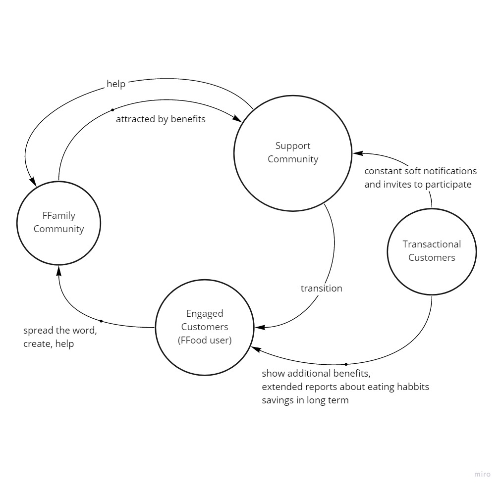
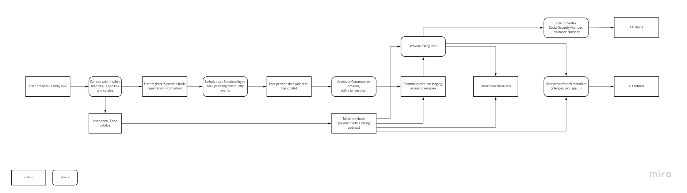
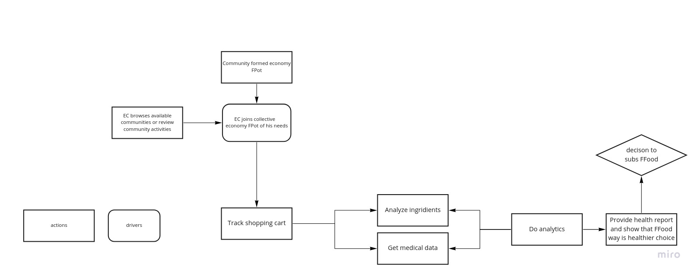
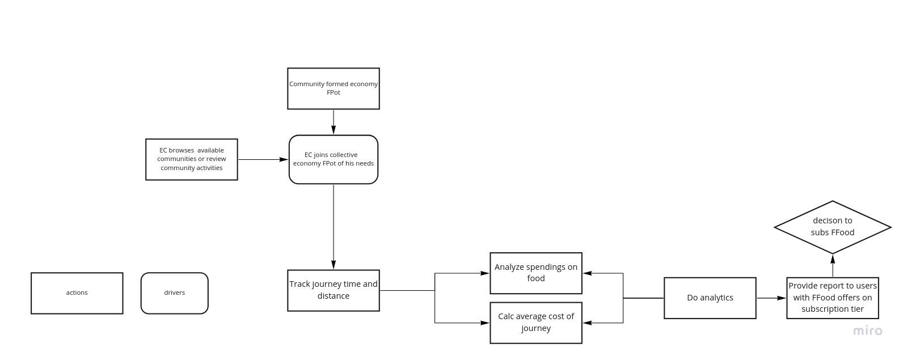
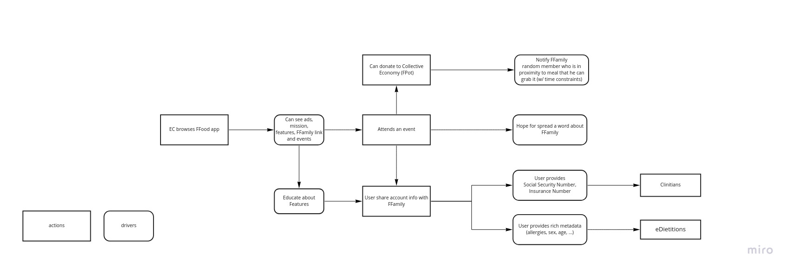
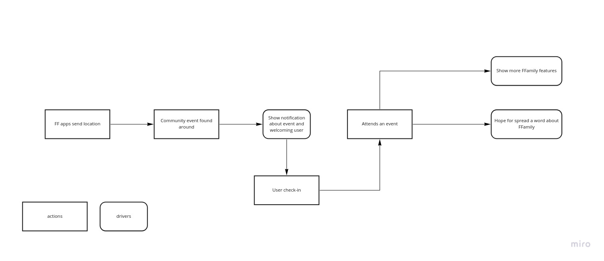
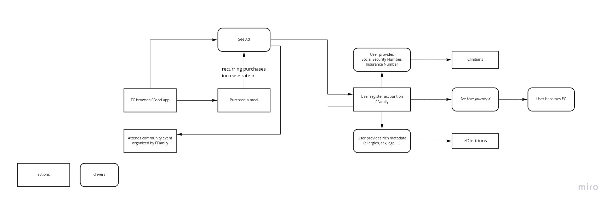

< [Back](README.md) < [Back to Home](../README.md#solution-structure)

# User Journeys

A user journey is the experiences a person has when interacting with software. It describes at a high level of detail exactly what steps different users take to complete a specific task within a system (application or website). This technique reveals areas of improvement for the to-be workflow.

## Overall strategy

Below diagram shows possible transition paths and main strategies on how to increase the user base for FFamily. We believe that customers who are engaged in community activities can be a better advertising strategy than an ad campaign for the FFamily in Forbes ;)

  |  |
  |:--:|
  | **Neighborhood Engagement and supporting cycle** |

## User registration journey

We decided to present this journey because it has a gamification aspect to it.
As the user provides his data (personal data, social security number, insurance) he will unlock access to eDietitian or/and clinician. Access to health professionals should create enough incentives to share data by user.
*
|  |
| :---: |
| **User registration** |

## Engaged Customer Makes Collective Purchase

These two journeys show how a user participates in a purchase driven by the collective economy. In both cases a user joins FPot and buys ingredients from a shopping lists. As the user collects items in local shops, a system analysis the shopping list and correlates it with user's medical data. The result of analytics is a report available to the user. The end goal is for EC to subscribe to FFod service. This goal can be achieved by health factor (image with health factor in title) or financial factor (image with financial factor in title)

**Example**: A FPot (shopping list) might be formed by the community based on the community's recipes, media library recipe, or dietitian recommendation. Collective purchase of bigger batches of food can save some money, but it requires time and effort to communicate between members. We'd like to show through analytical models that in the long run FFood is a better choice that saves user's time that can be converted to better productivity. Delicious and healthy food as a bonus that should increase quality of life ;)

|  |
| :---: |
| **Health factor** |

|   |
| :---: |
| **Time & Money Factor** |

## Community Building

Another possible scenario for user engagement is to offer user participation in his local community events.

The main point here is to raise awareness about FFamily to users of FFood about benefits for the user, and what are ways to help others, who share the same ideas, or are in need. We think that awareness will help to think about charity opportunities for already engaged customers. This concept is illustrated in the below image.

|  |
| :---: |
| **EC builds community** |

Besides, becoming a FFamily engagement member, the user of FFood can impact other people to get into the FFamily program. Happy FFood users more likely will spread the word about other benefits of FFamily. We just need to provide information flow about activities and events to FFood users. This scenario is illustrated in the below image.

|  |
| :---: |
| **TC builds community** |

## Conversion of Transactional Customer to Engaged Customer

Conversion of TC to EC is shown on the below image. When a TC purchases a meal, we will show him an ad that will redirect him to FFamily directly, or to an event organized by FFamily. Once a user is registered in the FFamily system, he will be able to execute more journeys.

|  |
| :---: |
| **Converting TC to EC** |

< [Back](README.md) < [Back to Home](../README.md#solution-structure)