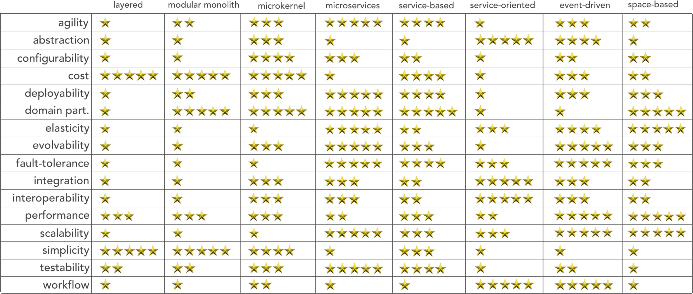

< [Back](README.md) < [Back to Home](../README.md#solution-structure)

# System approach - EDA + ES

## Date

2021-10-29

## Status

Proposed

## Context

We need to decide which architectural style will fit FFamily needs the best.

While choosing architectural style, we have to be aware of business drivers and technical constraints:

- teams capabilities
- developer's experience

The system has to analyze user's intentions, reasoning, and related data. Engagement mechanism reacts on user's actions that might not always lead to obvious data changes. I.e. one data entry might be changed by many reasons, the system has to know **why** exactly the data was changed. Also, no one knows what is the final set of FFamily feature set, so **evolvability** is an important characteristic of the developing system.

Another one key component is ability for integration. In requirements there are many references to 3rd party system integrations.

Below image shows architectural styles and its characteristics. We will choose one style from the list.

|  |
| :---: |
| Architectural Styles |

## Discussion

There are plenty good things about software implemented in Event Driven Architectural (EDA) style such:

- easy to scale
- easy to decouple components
- software components have high fault tolerance
- good responsiveness
- good agility

 However, we have to be focus on the disadvantages associated with EDA style such :

- Poor error handling - FFamily works as a recommendation system, and there is no legal or any other responsibilities to process data under great control. Opportunities missed by errors can be repeated, as long as there is data about events in the past. So it's not critical in our case.
- Workflow control can be complex - can be, but FFamily modules are almost self-contained, mostly CRUD, and internally it's totally fine to use synchronous communication.
- Event timing is difficult to sync - not a concern for our case.
- Components are still coupled by contract - we accepting this level of coupling
- Testing of user scenarios is hard - FFamily modules are almost self-contained, and react on integration events which is easy to provide for a module/service in isolation. We don't expect long event-driven chains.

FFamily's goal is to gather, connect and communicate with local community. We can infer that the appropriate model for community communication would be asynchronous communication. Moreover, asynchronous communication is perfect for a task that can be executed in the background -notifications, data processing, data analytics, or information flow between systems etc. We'll stress that we're well aware, that this architectural style can go haywire in domains with complex problems. But, because problems in this domain are not complex, we think this is a good architectural style for FFamily.

## Decision

Based on the low problem complexity, business needs and a small development team, we will choose a mix of **Event Driven Architecture** style + **Event Sourcing**.

Event driven communication within a module/service will be limited, with a tendency to emit integration events only for analytical and engagement engines.

## Consequences

1. We are planning to use OSS solutions without drastic changes, but there should be a possibility to chip in and emit integration events about user's actions.
1. A need for reliable dedicated event source storage. The same ES storage solutions from FFood might be used.
1. Ease to add new modules/services reacting to user's action in other modules. But it's only a reaction, not a processing chain towards a specific goal.

< [Back](README.md) < [Back to Home](../README.md#solution-structure)